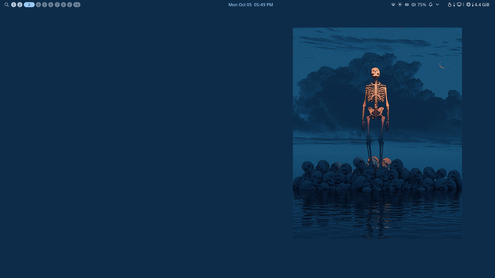
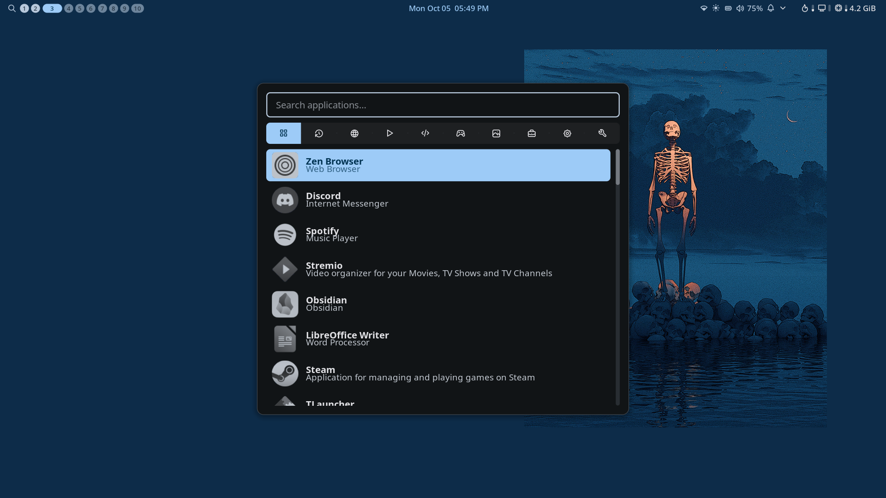
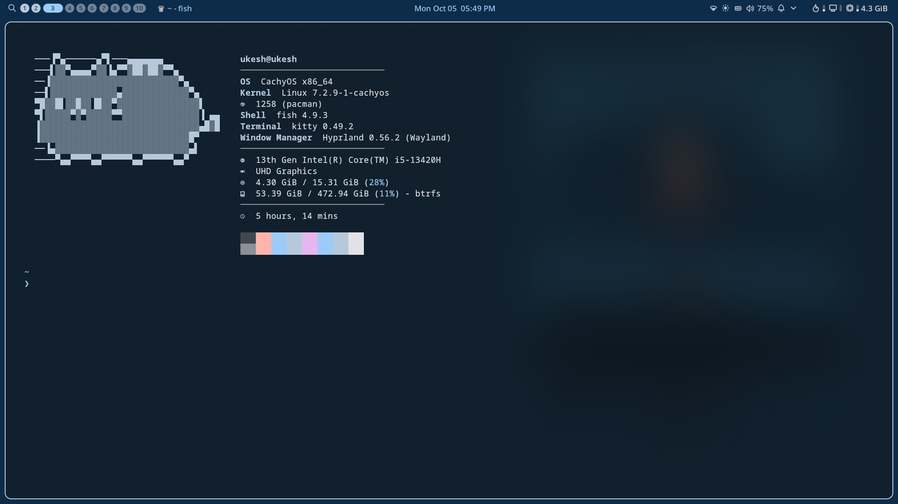

# Dotfiles

My Hyprland + Noctalia desktop setup, backed up so I can restore it on a new machine in one command.

## Preview



| Launcher | Fast Fetch|
|---|---|
|  |  |


## Requirements

`install.sh` only restores configs and does not install any apps. Install these first on the new machine:

- Hyprland
- Noctalia shell (and Quickshell if it is a separate package)
- fastfetch (or neofetch)
- Spicetify, PipeWire and WirePlumber, if you use them
- Your terminal, browser and anything else your configs call

## Restore on a new device

```bash
git clone https://github.com/ukesh-dhakal/Hyprland-Config
cd ~/dotfiles
./install.sh
```


